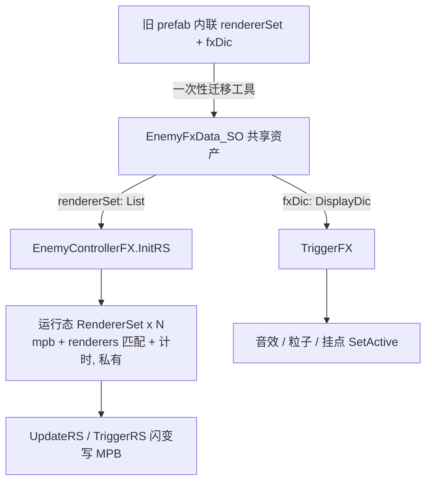
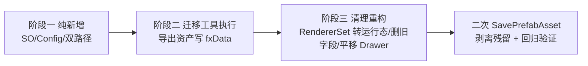

## 需求概述
对敌人特效配置做 **SO 化共享改造**，消除"同类敌人同屏 40+ 时每实例复制一份序列化配置"的内存与维护问题。

## 核心功能
- **共享配置 SO**：新建 `EnemyFxData_SO`（每敌人类型/prefab 变体一个资产），内部持有两组配置：
  - `rendererSet` 颜色/MPB 闪变配置（从现有 `RendererSet` 的纯配置字段抽出，命名 `RendererSetConfig`）；
  - `fxDic` 事件特效配置（音效/粒子/挂点，将原 `EnemyControllerFX` 内嵌 `FxSet` 平级化为 `FxSetConfig`）。
- **实例状态私有**：`RendererSet` 转为纯运行态类（保留 mpb、材质匹配结果、lastTriggerTime/lastOccasion、colorId 缓存），从共享配置构建；逐单位触发计时与 MPB 内容不共享。
- **存量一次性迁移工具**（编辑器）：扫描挂有 `EnemyControllerFX` 派生组件的 prefab，把内联 `rendererSet` + `fxDic` 数据导出为 SO 资产，并把 prefab 组件引用改为指向该 SO；不手工重建配置。
- **无实例覆盖**：每个敌人类型/prefab 变体对应自己的 SO；boss/精英不同则建不同 prefab/不同 SO。
- **行为保持不变**：材质匹配规则（`sharedMaterials[i] == material`）、Trigger/Update 时间窗、颜色插值/渐变、事件触发语义全部保持；刚做的 colorId PropertyID 缓存优化不回退。
- 需求确认边界：fxDic 一并收编；范围**不含**把 SO 资产登记进数据编辑器（可选后续）。


## 技术栈
- Unity 2022.3 LTS，C# 9.0 / .NET Standard 2.1，URP（无新依赖）。
- 复用项目现有约定：`_SO` 后缀数据类、`Assets/Resources/GameData/<类别>/` 资产目录、`Assets/Editor/` 编辑器工具目录、运行时代码不引用 UnityEditor、按数字前缀目录组织脚本。
- 新类型与现有 `FxCont` 类型同目录同命名空间（`FPSGame.AI`），与现状程序集归属保持一致（不新增 asmdef、不引 Editor 程序集）。

## 实现策略与关键决策

### 1. 采用"先加、再迁、后清"三阶段，避免迁移期间丢序列化数据
现有 prefab 的内联数据由 `RendererSet`（可序列化类）与嵌套 `FxSet` 承载。**若先改类型，Unity 反序列化会因类型路径/字段变化而丢弃旧数据**，因此顺序必须为：
- 阶段一（纯新增）：新增 `EnemyFxData_SO`、`RendererSetConfig`、`FxSetConfig` 与 `IFxSet`，`EnemyControllerFX` 增加 `fxData` 字段并支持"fxData 优先、旧字段兜底"的双路径。`RendererSet` 旧序列化形态、`FxSet` 旧嵌套类型保持不动（可被迁移工具用强类型 API 直接读取）。
- 阶段二（执行迁移）：运行编辑器迁移工具，把旧内联数据复制进 SO 资产并写入 `fxData` 引用，保存 prefab。
- 阶段三（清理重构）：把 `RendererSet` 改为纯运行态、删除旧字段/旧类型/兜底路径、平移 PropertyDrawer、二次保存 prefab 以剥离残留序列化数据。

### 2. 类型与文件划分
- `RendererSetConfig`：`[Serializable]` 纯数据（type/occasion/switchOccasion/material/colorName/defaultColor/switchColor/gradient/duration），供 SO 持有；`MPBTypeEnum` 提升为同文件顶层枚举（保持值顺序不变，避免迁移时枚举序号错位）。
- `FxSetConfig`：`[Serializable]` 顶层类（cilp/SG/ps/trans/go），与旧 `FxSet` 字段一一对应。
- `IFxSet`：只读访问接口，旧 `FxSet` 与新 `FxSetConfig` 共同实现，让过渡期 `TriggerFX` 用同一个泛型方法同时支持 legacy 与新 SO 两套字典。
- `EnemyFxData_SO : ScriptableObject`：持有 `rendererSet` 列表与 `DisplayDic(OccasionTypeEnum, FxSetConfig)` 字典（复用 `00Core/DisplayDic`）。
- `OccasionTypeEnum` 从 `RendererSet.cs` 拆出到独立文件（命名空间/程序集不变，序列化按值存储，无破坏）。

### 3. 运行态构建
- `EnemyControllerFX` 序列化字段收敛为：`fxData`（EnemyFxData_SO）+ 原有 `Animator`/`BirthMaterial`。运行时 `InitRS()` 遍历 `fxData.rendererSet`，为每个配置创建一个运行态 `RendererSet`（持配置引用 + 自身 mpb/匹配列表/计时），材质匹配规则不变；`TriggerRS/UpdateRS` 改遍历运行态列表。
- `TriggerFX` 改读 `fxData.fxDic`；`fxData` 为空时只告警一次并跳过（对应 GameMenuUtil 等临时添加、未配数据的对象）。

### 4. 迁移工具与 prefab 变体安全
- 工具位于 `Assets/Editor/EnemyFxDataMigrationTool.cs`（Editor 程序集），菜单项提供：干跑报告（列出命中 prefab、是否变体、是否有数据、建议 SO 路径）与正式迁移两步。
- 枚举方式：加载全部 `Assets/Resources/Prefabs` 下 prefab（进度条可取消），`GetComponentsInChildren<EnemyControllerFX>(true)` 判定命中，兼容后续新增派生控制器。
- 资产落点：`Assets/Resources/GameData/EnemyFx/<Prefab 相对目录镜像>/EFX_<PrefabName>.asset`（目录自动创建，镜像子路径避免同名 prefab 冲突）；命名符合项目资产短前缀风格。
- **变体处理**：先递归迁移基类 prefab；对变体，若其自身文件层面对这两个字段无覆写则跳过（继承基类 SO）；有覆写时用 prefab 资产级 SerializedObject 修改 + `SavePrefabAsset`，避免 `LoadPrefabContents/SaveAsPrefabAsset` 把基类内容烘焙进变体、破坏变体连接。
- 场景中直接放置且带内联配置的非 prefab 实例：工具输出清单提示，不做自动迁移（一次性风险极低，逐个手动确认）。

### 5. 编辑器配套调整
- 原 `RendererSetEditor`（`#if UNITY_EDITOR` 置于 `RendererSet.cs`）清理阶段迁到 `Assets/Editor/Drawer/` 并改名为 `RendererSetConfigDrawer`（目标类型改为 `RendererSetConfig`，字段绘制逻辑平移，含 Gradient/颜色行高排版）。
- 子类 `EnemyFXControllerUnit`/`BuildingFXController` 的 `AutoInit`（编辑器 ContextMenu）改写到 `fxData` 资产上：无资产时在 `GameData/EnemyFx` 下创建并赋值，写后 `EditorUtility.SetDirty` + `AssetDatabase.SaveAssets`；`EnemyFXControllerUnit.Start()` 里读取 Movement 音频改为读 `fxData.fxDic`。

## 性能与可靠性
- 逐帧路径不变：Init 一次性构建运行态；运行态 `RendererSet` 空闲只有时间比较，闪窗内才写 MPB；保留 colorId/PropertyID 缓存，不因 SO 化引入每帧字符串哈希。
- 共享收益：序列化配置（渐变曲线/颜色/时长/FxSet）全局一份，N 实例共享；美术改一个资产所有敌人生效。
- 风险控制：迁移分干跑/执行；每 prefab 独立 try/catch 并输出失败清单；执行前可用 `git`/VCS 快照回退；清理阶段（删字段后）必须做一次全量 `PrefabUtility.SavePrefabAsset` 剥离残留序列化数据，并用编译 + PlayMode 冒烟验证（受击闪白、攻击/死亡事件 FX、移动音）。

## 系统结构（Mermaid）



## 目录结构
```
Assets/Scripts/02Game/AI/FxCont/
├── OccasionTypeEnum.cs        [NEW] OccasionTypeEnum 独立文件（从 RendererSet.cs 迁出，命名空间不变）
├── RendererSetConfig.cs       [NEW] RendererSetConfig（可序列化纯配置）+ 顶层 MPBTypeEnum（值顺序与旧枚举一致）
├── FxSetConfig.cs             [NEW] FxSetConfig 顶层可序列化类 + IFxSet 只读访问接口
├── EnemyFxData_SO.cs          [NEW] EnemyFxData_SO（ScriptableObject）：List(RendererSetConfig) rendererSet + DisplayDic(OccasionTypeEnum, FxSetConfig) fxDic；[CreateAssetMenu] 菜单 Data/EnemyFx
├── RendererSet.cs             [MODIFY] 保留旧可序列化形态至迁移完成；清理阶段转为纯运行态（持 RendererSetConfig 引用 + mpb/renderers/lastTriggerTime/lastOccasion/colorId 缓存，Add/Trigger/Update 全部改读配置）
├── EnemyControllerFX.cs       [MODIFY] 新增 [SerializeField] fxData + 运行态 rsRuntime 列表；InitRS/TriggerRS/UpdateRS 双路径（fxData 优先）；TriggerFX 泛型读 IFxSet 字典；清理阶段删除旧 rendererSet/fxDic 字段与兜底
├── EnemyFXControllerUnit.cs   [MODIFY] Movement 音频读取改 fxData；AutoInit 改写 SO
├── BuildingFXController.cs    [MODIFY] AutoInit 改写 SO
Assets/Editor/
├── Drawer/RendererSetConfigDrawer.cs [NEW] RendererSetConfig 的 PropertyDrawer（平移原 RendererSetEditor 排版逻辑）
└── EnemyFxDataMigrationTool.cs       [NEW] 迁移工具：干跑报告 + 正式迁移 + 变体安全处理 + 失败清单
Assets/Resources/GameData/EnemyFx/   [NEW 资产目录] 每敌人一个 EFX_<PrefabName>.asset（镜像 prefab 相对子目录）
```
其他影响点：`EnemyControllerFX_AboState.cs`（不依赖 rendererSet/fxDic，仅确认不破坏）、`GameMenuUtil.cs`（AddComponent 空配置场景靠 fxData 空值守卫兼容）。

## 边界说明
- 运行态 `RendererSet` 不再序列化到 prefab，prefab 上只保留 `fxData` 资产引用；旧内联数据在清理阶段二次保存后被自然剥离。
- 迁移工具须在"清理阶段删除旧字段"之前运行；遗漏的 prefab 由干跑报告清单兜底提示。
- 不将 EnemyFxData_SO 接入数据编辑器（用户未要求，作为可选项留待后续）。


## Agent Extensions
### Skill
- **bluedivers-unity**
  - 用途：贯穿所有编码任务，约束命名/目录/`_SO` 后缀/Editor 与运行时隔离/C# 版本等项目规范，保证新增类型与重构贴合项目架构。
  - 预期产出：新增/修改脚本均符合项目既有约定，无运行时引用 UnityEditor、无超出 C# 9 语法、资产命名遵循前缀规范。
### SubAgent
- **code-explorer**
  - 用途：迁移阶段精确盘点挂有 EnemyControllerFX 派生组件的全部 prefab（含 BuildingFXController 命中面、变体关系与各 prefab 内联数据规模），支撑迁移工具设计与执行后抽查验证。
  - 预期产出：命中 prefab 清单（路径/是否为变体/是否有配置数据）、迁移前后 YAML 抽样对比与遗漏项报告。
