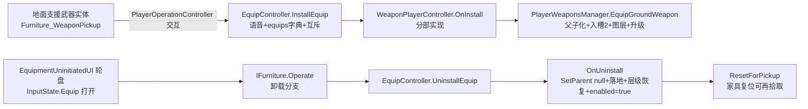

## 产品概述
为支援武器补全"地面实体 → 交互拾取 → 入槽使用 → 轮盘卸载 → 回落地面再拾取"的完整闭环。支援武器初始不在玩家武器槽中，进入战斗后以地面实体形式存在，玩家靠近按交互键拾取（走 EquipController 统一装备流程：equips 字典管理 + 安装/卸载语音 + NeedUninstall 互斥能力），丢弃时武器脱离玩家、落地为可再次交互的实体。

## 核心功能
- 武器实现 IEquippable：WeaponPlayerController 通过分部文件实现 IEquippable，拾取/卸载统一走 EquipController.InstallEquip/UninstallEquip
- 交互拾取：新增 Furniture_WeaponPickup 交互组件（挂在支援武器预制体上），仅允许拾取 WeaponTypeEnum=Support 的武器，且仅当支援槽（槽2）为空时可拾取；走现有 PlayerOperationController 交互链（第一人称射线/第三人称近距扫描）
- 轮盘卸载：武器入 equips 字典后自动出现在 EquipmentUninitiatedUI 轮盘"丢弃装备"中，点击轮盘项调用家具 Operate() 完成卸载（复用现有 InputState.Equip 绑定，不新增任何输入）
- 落地可再拾取：卸载时武器 SetParent(null) 落地、组件 re-enable 恢复交互可见、保留弹药/升级状态、恢复原层级；随后自动切换到下一把可用武器
- UI 同步：拾取/卸载时武器栏槽2图标刷新（现有回调为空实现）

## 边界与规则
- 可卸载武器：仅 WeaponTypeEnum=Support（Grenade/FlareGun/Empty/Armor 排除），且为主手武器、武器切换状态为 Up 时
- 可拾取武器：仅 Support 类型，且支援槽为空
- 不支持"任意武器落地/拾取"与其他槽位替换，保持本轮范围聚焦


## 技术栈
- Unity 2022.3.62f2c1 (2022 LTS)，C# 9.0 / .NET Standard 2.1，URP 14.0.12
- 沿用现有架构：Furniture 交互体系（Furniture_Attached + IFurniture + 静态注册表 list）、EquipController 装备管理、PlayerOperationController 交互输入、EquipmentUninitiatedUI 轮盘

## 实现思路
### 关键决策：partial 分部实现，不新建子类
直接对 WeaponPlayerController 新增分部文件 WeaponPlayerController_Equip.cs（项目约定：主类名_分部名.cs 同目录）实现 IEquippable，不新建继承子类。理由：
1. 全项目武器以 WeaponPlayerController 具体类型流转（AddWeapon/OnSwitchedToWeapon/UI/ArchiveSvc），引入子类需替换大量类型引用，无行为差异收益
2. IEquippable.Owner 为 I_Actor 类型，与 WeaponController 现有 Owner（GameObject）字段同名冲突，用显式接口实现规避（项目 Furniture_Base 显式实现 I_Entity 已有先例）

关键接口结构（概要，实现时按现有代码核对）：
```csharp
public partial class WeaponPlayerController : IEquippable
{
    I_Actor m_EquipOwner;                 // 缓存，OnUninstall 落地取玩家位置
    I_Actor IEquippable.Owner => m_EquipOwner;
    string IEquippable.ID => WeaponName;
    bool IEquippable.HaveFlag(EquippableFlagEnum flag) => false;   // 武器不占用 UseSpace
    bool IEquippable.NeedUninstall(IEquippable newEquip) => false; // 与背包类装备共存
    void IEquippable.OnInstall(I_Actor actor, Func<IEnumerable<IEquippable>> list);  // → 入支援槽
    void IEquippable.OnUninstall();                                 // → 落地 + 家具复位 + enabled=false
    event Action<IEquippable> IEquippable.OnEquipDestroy;           // OnDestroy 触发（先检索现有 OnDestroy 防重复）
}
```

### 架构与数据流


### 实现要点
- EquipGroundWeapon（复用重构 AddWeapon）：AddWeapon = Instantiate + EquipGroundWeapon；后者含槽位空检查（SlotOf(WeaponTypeEnum)=槽2）→ SetParent(WeaponParentSocket) → PlayerIndex/Owner/FpsWeaponLayer 子物体图层 → 存档 ApplyUpgrade → OnAddedWeapon → 空手自动切换；捡起前缓存武器原层级，卸载时恢复（否则 FpsWeaponLayer 导致主相机不可见/穿模）
- DetachWeapon（摘除不销毁）：槽位置 null → OnRemovedWeapon → 断武器事件订阅（SetWeaponState(false)）→ 若为主手武器切下一把（SwitchWeapon(true)）；不调用 Tool.Destroy
- Furniture_WeaponPickup：继承 Furniture_Attached（或 Furniture_Equip 覆写）；覆写 ShowName/Id/Desc（基类取 _actor.ShowName，武器无 I_Actor 会 NRE）；CanOperate = 基类条件 && Support 类型 && 玩家支援槽为空；Operate = InstallEquip + canOperate=false；CanOperate(unit) 用 unit.GetComponent<PlayerWeaponsManager>() 限定玩家
- 射线拾取：PlayerOperationController.TrySetTarget 的 hit.transform.GetComponent<IFurniture>() 改为 GetComponentInParent（低风险改进，兼容 Collider 在子物体的武器预制体）
- 轮盘卸载兼容：EquipmentUninitiatedUI 已通过 furniture.Operate() 调卸载分支，Furniture_WeaponPickup 需覆写 Operate 使卸载走干净分支（避免触发 SwitchState 家具流程干扰 PlayerWeaponsManager.OnOperation）
- 弹药/升级状态保留：不销毁不清空，武器实例原样落地可再捡

## 目录结构
```
Assets/Scripts/02Game/
├── Game/Shared/Weapon/
│   └── WeaponPlayerController_Equip.cs   # [NEW] IEquippable 分部实现（拾取/卸载逻辑）
├── 05Interactable/
│   └── Furniture_WeaponPickup.cs         # [NEW] 武器拾取交互组件（继承 Furniture_Attached）
├── 03Player/
│   ├── PlayerWeaponsManager.cs           # [MODIFY] EquipGroundWeapon/DetachWeapon/AddWeapon 重构
│   └── PlayerOperationController.cs      # [MODIFY] 射线 GetComponentInParent
└── 04UI/
    └── PlayerWnd.cs                      # [MODIFY] AddWeapon/RemoveWeapon 回调实现槽位图标刷新
```
（可选）EquipController.cs 若需返回卸载是否成功以协调落地方位

### 用户手动配置（AI 不动资源）
- 支援武器预制体：WeaponTypeEnum=Support、根物体加 Collider、挂 Furniture_WeaponPickup、武器名/图标配置
- TestScene 手动摆放地面支援武器实体做验证


## Agent Extensions
### Skill
- **bluedivers-unity**
  - Purpose: 提供项目架构约定（partial 命名、Furniture 体系、asmdef 分层、Inspector 中文化）与避坑指南（Furniture_Attached 的 list 注册机制、_actor NRE 问题），确保新组件/分部文件遵循项目既有模式
  - Expected outcome: 新增代码命名/目录/依赖方向正确，无违规引用
- **lsp-code-analysis**
  - Purpose: 检索 WeaponPlayerController 全部现有分部文件与基类 WeaponController 的 OnDestroy/OnDisable/Owner 成员定义，确认显式接口实现无成员冲突、无 partial 重复定义
  - Expected outcome: partial 实现无重复成员，Owner 冲突规避方案验证通过
### SubAgent
- **code-explorer**
  - Purpose: 当单次文件检索不足以确认 WeaponController 基类成员、WheelUI 轮盘基类签名、各现有 Furniture 子类模式时，用于跨文件/跨目录的补充探索
  - Expected outcome: 确认所有修改点的依赖链与既有模式，避免方案遗漏
